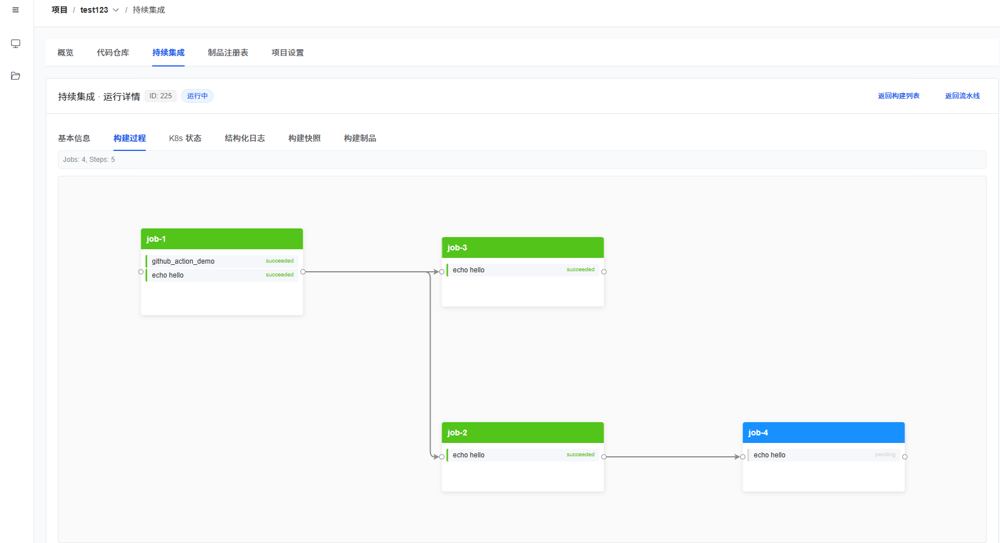
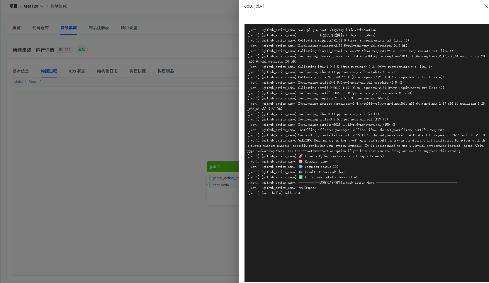
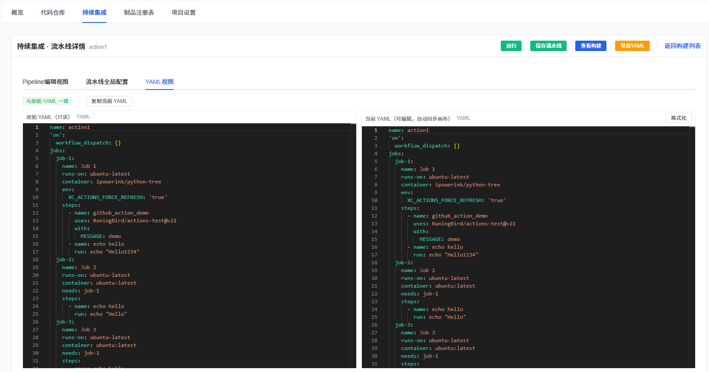
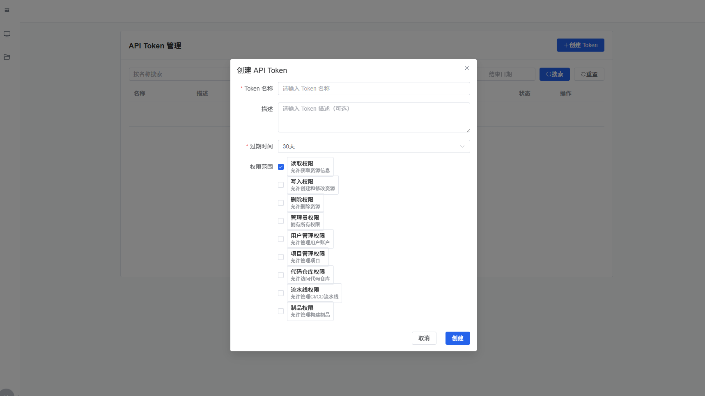

# XCoding 平台

项目以 Buf/proto 定义接口、gRPC + gRPC-Gateway 暴露服务、APISIX 网关、通过 Helm 管理部署的 Kubernetes 微服务项目。包含用户、项目、代码仓库、制品库与 CI 执行器/流水线等核心微服务，以及前端管理界面。

## 基本特点
- 统一协议：使用 `buf` 管理 `proto`，HTTP 由 `google.api.http` 注解自动映射到 gRPC，经 `grpc-gateway` 暴露。
- 网关与认证：APISIX Ingress 统一入口；使用 `forward-auth` 将认证委托给 User 服务，回传 `X-User-*` 与 `X-Scopes` 头。
- 微服务边界清晰：User（认证与令牌）、Project（成员与权限）、Code Repository（项目代码仓库）、Artifact（镜像/制品元数据）、CI（Pipeline 与 Executor）。
 - K8s 原生：各服务以 Deployment/Service 暴露；健康探针使用 gRPC/HTTP；CI 执行器通过 K8s Job 运行流水线 Job，并采集日志与状态。
 - Helm 管理：单 Chart 编排第三方依赖（APISIX/PostgreSQL/RabbitMQ/Registry）与各服务模板，支持一键安装/升级。

## 界面预览
- 任务执行中：
- Job 运行结果查看：
- 实时查看 YAML 视图：
- 新建 API Token：
- 设置主题：

## 部署方式
1. 准备 Kubernetes 集群，并确保本机可用的 `kubectl`、`helm`、`docker`。
2. 进入仓库根目录，按需修改 `deploy/xcoding/values.yaml` 中镜像仓库与端口等配置。

### 一键部署（推荐）
- 使用 `deploy/deploy_all.py` 执行全量构建/推送/部署：
  - 运行：`python deploy/deploy_all.py`
  - 可通过 `python deploy/deploy_all.py -h` 查看可用选项

### 按微服务部署（可选）
- 用户服务：`python deploy/python/user/deploy.py --tag <tag>`
- 项目服务：`python deploy/python/project/deploy.py --tag <tag> --action deploy`
- 代码仓库服务：`python deploy/python/code_repository/deploy.py --tag <tag>`
- CI 执行器：`python deploy/python/executor_service/deploy.py --tag <tag>`
- CI Pipeline：`python deploy/python/ci/deploy.py --tag <tag>`
- 前端：`python deploy/python/frontend/deploy.py --tag <tag>`

### Helm 安装/升级
- `helm upgrade --install xcoding deploy/xcoding -n xcoding`

### 访问入口
- APISIX 通过 NodePort 暴露（默认 `31080`），示例域名 `api.xcoding.local`/`xcoding.local`。

提示：脚本会自动更新对应 Helm 模板中的镜像标签，并在命名空间不存在时创建 `xcoding` 命名空间；安装后可通过脚本提供的状态与日志命令查看部署情况。

## 文档索引
- [用户服务概述](docs/user/README.md)与[权限/令牌范围](docs/user/permissions.md)。
- [项目服务概述与接口](docs/project/README.md)；权限模型参见 [docs/project/project-permissions.md](docs/project/project-permissions.md)。
- [代码仓库服务架构说明](docs/code_repository/feature/README.md)；权限见 [docs/code_repository/permissions.md](docs/code_repository/permissions.md)。
- [制品服务概述](docs/artifact/README.md)；权限见 [docs/artifact/permissions.md](docs/artifact/permissions.md)。
- [单元/E2E 测试策略与运行指南](docs/tests/README.md)。
- [CI Pipeline 服务说明、数据流与架构图](docs/ci/pipeline_service/README.md)。
- [CI 执行器服务说明、数据流与架构图](docs/ci/executor_service/README.md)。
- [CI 插件`steps.uses` 的规划与当前进度](docs/ci/actions/progress.md)。

## 代码生成
- Buf 配置：`buf.yaml`，模块路径 `proto/`。
- 生成命令示例：`buf generate`。

## 许可
本项目源代码遵循BSD-3许可声明
