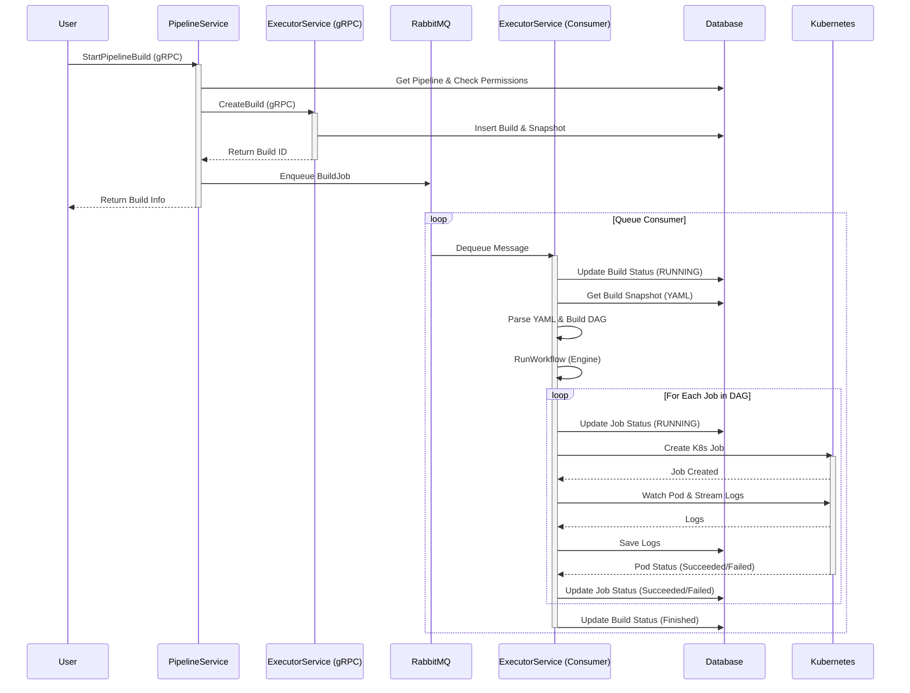

# CI Backend Execution Flow

This document outlines the execution flow of the CI backend, starting from the trigger to the actual execution of jobs on Kubernetes.

## Overview

The CI system consists of two main services:
1.  **Pipeline Service**: Handles pipeline definitions, permissions, and triggers.
2.  **Executor Service**: Handles the actual execution of builds, manages the build queue, and interacts with Kubernetes.

## Execution Flow

The following diagram illustrates the step-by-step process of a CI build execution.

## Detailed Steps

### 1. Trigger (Pipeline Service)
*   **Entry Point**: `StartPipelineBuild` in `pipeline_service`.
*   **Validation**: Checks if the pipeline exists and if the user has permissions.
*   **Build Creation**: Calls `ExecutorService.CreateBuild` to create the initial build record and snapshot the workflow YAML in the database.
*   **Enqueue**: Pushes a message containing the `BuildID` and other metadata to the RabbitMQ queue.

### 2. Queue Consumption (Executor Service)
*   **Consumer**: `QueueConsumer` in `executor_service` listens to the queue.
*   **Initialization**: Upon receiving a message, it updates the build status to `RUNNING`.
*   **Parsing**: It retrieves the workflow YAML snapshot from the database and parses it into a DAG (Directed Acyclic Graph).

### 3. Execution Engine
*   **DAG Engine**: The `Engine` traverses the DAG. It identifies jobs that are ready to run (dependencies met).
*   **Concurrency**: Independent jobs are executed concurrently.

### 4. Job Execution (Scheduler)
*   **K8s Job**: For each job, the `Scheduler` creates a Kubernetes Job resource.
*   **Log Streaming**: It streams logs from the created Pod back to the database and/or clients.
*   **Monitoring**: It polls the Pod/Job status until completion.
*   **Status Update**: Updates the individual job status in the database.

### 5. Completion
*   Once all jobs in the DAG are completed (or a failure occurs), the `Engine` updates the final status of the Build in the database.
