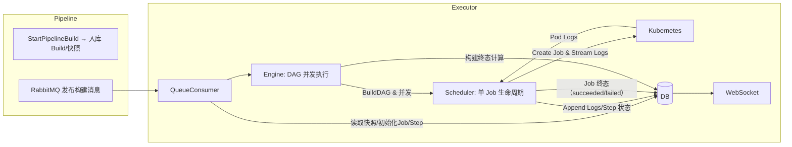

# CI Executor Service 文档

本文档基于当前实现重写，涵盖架构、数据流、关键代码位置与可视化图示，匹配 `apps/ci/executor_service` 的实际行为。

## 服务职责
- 消费由 Pipeline 服务入队的构建任务，解析工作流 YAML，构建 DAG 并按 `needs` 并发调度 Job
- 为每个 Job 创建 K8s `Job`，在容器中执行步骤脚本，采集日志与步骤状态
- 收敛 Job 状态，最终由引擎在所有 Job 完成后统一计算构建终态
- 提供 WebSocket 实时推送：构建状态、DAG、Job/Step 状态与增量日志

## 架构图（Mermaid）


## 数据流与状态
- 入队：`QueueConsumer` 接收 `build_id`，加载 `BuildSnapshot` 的 `WorkflowYAML`，初始化 `BuildJob`、`BuildStep` 与 DAG 边（`apps/ci/executor_service/internal/consumer/queue_consumer.go:77`）
- 引擎：`Engine.RunWorkflow` 构建 DAG，严格按 `needs` 并发；完成后计算构建终态（`apps/ci/executor_service/internal/executor/dag_engine.go:24`、`107`）
- 调度器：`Scheduler.RunSingleJob` 创建 K8s Job，轮询 Pod，流式读取日志并解析标记驱动 Step 状态；在 Job 结束时兜底收敛步骤终态（`apps/ci/executor_service/internal/executor/dag_scheduler.go:53`、`131`）
- 扩展：TTL/超时（`XC_JOB_TIMEOUT_SECONDS`）在 `BuildJobSpecWithExtensions` 注入（`apps/ci/executor_service/internal/executor/podspec_extensions.go:10`）
- 脚本与 Actions：
  - `BuildScript(job)` 支持 `steps.run` 与 `steps.uses`，`uses` 通过 `actions.BuildUsesScript` 动态生成片段（`apps/ci/executor_service/internal/executor/script_builder.go:25`）
  - 解析远端 `owner/name@version`（支持 `owner/name/path@version`），下载 `action.yml` 并解析 `runs.using`
  - `composite`：展开子步骤（`run`），嵌套 `uses` 提示不支持（日志含 `nested uses not yet supported`）
  - `node`：容器存在 `node` 运行时则执行 `main`，否则提示缺失
  - `docker`：当前 Runner 不支持，日志提示
  - 关键实现：解析与脚本生成（`apps/ci/executor_service/internal/executor/actions/resolver.go:1`、`123`、`160`）、下载脚本（`actions/download_script.go:1`）、元数据解析（`actions/metadata.go:1`）；工作目录为 `/workspace`（`internal/config/job_config.go:3`）。
- WebSocket：`ws.Handler` 聚合构建状态、DAG、增量日志（`apps/ci/executor_service/internal/ws/handler.go:159`）

## 关键约定
- 日志标记：`__step_begin__/__step_end__/__step_exit__` 用于驱动 Step 状态机
- 资源与超时：`XC_RESOURCE_*` 注入容器资源限制；`XC_JOB_TIMEOUT_SECONDS` 控制单 Job 超时；TTL 通过 `ParseTTLFromEnv`
- 调度失败判定：不可调度（`Unschedulable`）或容器未就绪视为 Job 失败，并收敛步骤终态

## 重要代码位置
- 引擎：`apps/ci/executor_service/internal/executor/dag_engine.go:24`、`107`
- 调度器：`apps/ci/executor_service/internal/executor/dag_scheduler.go:53`、`131`
- 脚本生成：`apps/ci/executor_service/internal/executor/script_builder.go:25`
- PodSpec 扩展：`apps/ci/executor_service/internal/executor/podspec_extensions.go:10`
- WebSocket：`apps/ci/executor_service/internal/ws/handler.go:159`
- 队列消费入口：`apps/ci/executor_service/cmd/main.go:73`（启动）与 `internal/consumer/queue_consumer.go:77`

## 示例工作流（摘自前端示例）
- 参考 `apps/frontend/public/workflows/example_pipeline.yml`，包含 Job `needs`、矩阵、服务容器、环境与步骤
- Actions 使用示例（与测试脚本一致）：
  ```yaml
  name: action1
  'on': { workflow_dispatch: {} }
  jobs:
    job-1:
      name: Job 1
      runs-on: ubuntu-latest
      container: ipowerink/python-tree
      env:
        XC_ACTIONS_FORCE_REFRESH: 'true'
      steps:
        - name: github_action_demo
          uses: RuningBird/actions-test@v21
          with:
            MESSAGE: demo
        - name: echo hello
          run: echo "Hello1234"
  ```

## 测试脚本
- 位置：`deploy/python/executor_service/test_runner.py`
- 能力：
  - 可选跳过部署（`--skip-deploy`）
  - 更新流水线 YAML（`--update-yaml`）以注入 `uses` 步骤
  - 触发构建并查找 Pod，跟随容器日志，聚合关键错误提示
- 核心 API 与行为：
  - 触发构建：`POST /ci_service/api/v1/pipelines/{pipeline_id}/builds`（`trigger_pipeline`）
  - 更新 YAML：`PUT /ci_service/api/v1/pipelines/{pipeline_id}`（`update_pipeline_yaml`）
  - Pod 查找与日志跟随：`find_pod`、`stream_logs`

## 运维与调试
- 通过 `kubectl logs` 查看 Pod 日志；WS 接口提供实时视图
- 观察构建终态：引擎在所有 Job 完成后统一落库；失败或全部成功时写入 `finished_at`
- TTL/超时与资源注入可在 Job env 中配置
```
