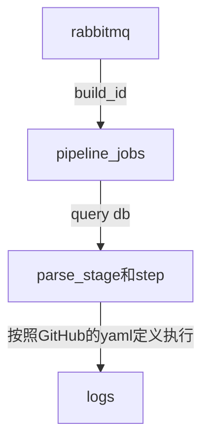

# CI Pipeline Jobs 蓝图

## 目标
- 将构建触发（RabbitMQ）与云原生执行（Kubernetes）解耦，形成可扩展、可观测的流水线执行框架。
- 解析 `.workflows/example_pipeline.yml`，支持 Job 级 `needs` 编排与 Step 顺序执行。
- 提供清晰的分层与接口，便于后续扩展插件、日志、重试、权限等能力。

## 总体架构
- 入口服务通过 `StartPipelineBuild` 创建构建为 `BUILD_STATUS_PENDING`，成功发布消息后更新为 `BUILD_STATUS_QUEUED`。
- Worker 消费 `build_id`，查询 DB 获取上下文（pipeline、workflow_yaml、变量等），开始执行时更新为 `BUILD_STATUS_RUNNING`。
- 解析 YAML → 构建 Job DAG（考虑 `needs`）→ 执行 Job（并发受 `needs` 约束）→ Step 顺序执行，采集并落日志 → 推进状态至终态。

## 目录结构（建议）
- `apps/ci/pipeline_service/cmd/worker`
  - 入口二进制（K8s Job/Deployment），加载配置、连接队列、启动消费与编排。
- `apps/ci/pipeline_service/jobs`
  - `models`：持久化模型与 DTO（Build/Job/Step/Log/状态枚举与转换）。
  - `parser`：YAML 解析与校验，映射到内部 `WorkflowSpec/JobSpec/StepSpec`。
  - `dag`：基于 `needs` 的 DAG 构建、拓扑排序、循环检测、并发计划生成。
  - `executor`：执行引擎，Job 并行（受 `needs` 约束）、Step 顺序执行；支持 `run`/`uses`。
  - `plugins`：`uses:` 适配层，复用/桥接现有 `pipeline_plugin`。
  - `queue`：队列接口与 RabbitMQ 实现，消息协议与重试策略。
  - `logs`：日志采集与落库/对象存储，面向 UI 的检索接口。这个暂时先搞个db表存入吧
  - `services/<feature>`：如 `orchestrator`、`workspace`、`artifact`、`secrets` 等功能子域。

说明：`cmd` 仅作为入口；复用逻辑全部位于 `jobs/*`，避免主包耦合。

## 核心接口（草案）
- `QueueClient`：`ConsumeBuild()`, `Ack(msg)`, `Nack(msg, requeue)`；载荷至少包含 `build_id`。
- `Parser`：`ParseWorkflow(yaml) (WorkflowSpec, error)`；校验语义与结构。
- `DAGBuilder`：`Build(spec) (Plan, error)`；根据 `needs` 构建 Job 级 DAG 并拓扑排序。
- `Executor`
  - `RunJob(ctx, job, ws) error`：按 Step 顺序执行，支持 `env` 级联与超时。
  - `RunStep(ctx, step, ws) error`：`run` 在容器内执行；`uses` 经插件桥接。
- `StatusStore`：`SetBuildStatus(buildID, status)`, `SetJobStatus(jobID, status)`, `SetStepStatus(stepID, status)`。
- `LogSink`：`Append(refType, refID, chunk)`, `Stream(refType, refID, cursor)`。
- `Orchestrator`：`Start(buildID) error`（查询 DB→解析 YAML→DAG→执行→状态推进）。

## 执行流程
- 消息入队：`StartPipelineBuild` 创建构建为 `PENDING`，成功发布后更新为 `QUEUED`。
- Worker 消费：显式 `ack`；开始执行时更新构建为 `RUNNING`；查询 `pipeline_id`、`workflow_yaml`、变量、触发者等。
- 解析与编排：`parser` 生成 `WorkflowSpec`；`dag` 构建 Job 级计划，检测循环与缺失。
- 执行与日志：Job 并行（受 `needs` 限制）；Step 顺序执行；实时写入日志与状态。
- 完成与清理：成功/失败更新 `Build` 终态；保留工作空间与工件；错误可重试或标记失败。

## needs 处理
- 作用域：对 Job 级生效（与 GitHub Actions 一致）；无 `needs` 的 Job 默认并行执行。
- 规则：拓扑排序确保依赖先执行；上游失败默认阻断下游（可后续引入策略开关）。
- 校验：循环检测、未知节点、空依赖清洗；生成并发批次计划以便执行器控制。

## 数据模型与状态机（建议）
- `build_jobs`：`(id, build_id, name, status, needs[], started_at, finished_at, error)`。
- `build_job_steps`：`(id, job_id, name, type(run|uses), status, logs_ref, env, started_at, finished_at, error)`。
- `build_logs`：`(ref_type(build|job|step), ref_id, chunk_seq, content, created_at)` 或对象存储引用。
- 状态机：`PENDING → QUEUED → RUNNING → SUCCEEDED | FAILED | CANCELLED`（Job/Step 维度亦维护独立状态）。

## Kubernetes 运行形态
- Job 粒度：每个 YAML Job 映射为一个 `Kubernetes Job`（每个 Job 一个 Pod）。
- Worker 职责：Orchestrator 创建与监控 K8s Job，聚合状态与日志。
- 工作空间：PVC 或对象存储；`actions/checkout` 将代码拉入共享空间，后续 Step 复用。
- 资源与安全：限制 CPU/内存、只挂所需 Secrets/ConfigMap、最小权限。

## 消息载荷、幂等与重试
- 载荷：`build_id` 足够；通过 DB 查询完整上下文（pipeline、yaml、变量、触发者）。
- 幂等：同一 `build_id` 在执行中或已完成时拒绝重复；使用幂等锁或执行标记。
- 重试：区分队列消费失败与执行失败；合理设置重试上限与退避策略，避免风暴。

## 与现有代码兼容点
- 保持 `StartPipelineBuild` 初始状态为 `PENDING`；入队成功更新为 `QUEUED`；Worker 启动执行后更新为 `RUNNING` 并细分 Job/Step 状态。
- 复用 `apps/ci/pipeline_plugin` 作为 `uses:` 的执行后端或桥接层，减少重复实现。
- 配置与网关：沿用 `cmd/main.go` 的 `config.Load()`；Worker 入口统一配置加载队列与 DB。

## 接口草案细化（方法签名）
- QueueClient（RabbitMQ 实现）
  - `PublishBuild(ctx context.Context, buildID string) error`
  - `ConsumeBuild(ctx context.Context) (<-chan QueueMessage, error)`
  - `Ack(ctx context.Context, msg QueueMessage) error`
  - `Nack(ctx context.Context, msg QueueMessage, requeue bool) error`
  - `type QueueMessage struct { ID string; BuildID string; DeliveredAt time.Time }`

- Parser（YAML→Spec）
  - `ParseWorkflow(ctx context.Context, yaml []byte) (*WorkflowSpec, error)`
  - `type WorkflowSpec struct { Name string; Jobs map[string]JobSpec; Env map[string]string }`
  - `type JobSpec struct { Name string; Needs []string; Steps []StepSpec; Env map[string]string }`
  - `type StepSpec struct { Name string; Run *RunSpec; Uses *UsesSpec; Env map[string]string; Timeout time.Duration; WorkingDir string; ContinueOnError bool }`
  - `type RunSpec struct { Shell string; Command string }`
  - `type UsesSpec struct { Ref string; With map[string]string }`

- DAGBuilder（Job 级 DAG 与并发计划）
  - `Build(ctx context.Context, spec *WorkflowSpec) (*Plan, error)`
  - `type Plan struct { Batches [][]string /* 每个批次可并行的 Job 名 */ }`

- Executor（执行引擎）
  - `ExecutePlan(ctx context.Context, build *Build, spec *WorkflowSpec, plan *Plan, ws Workspace) error`
  - `RunJob(ctx context.Context, build *Build, job JobSpec, ws Workspace) error`
  - `RunStep(ctx context.Context, build *Build, job JobSpec, step StepSpec, ws Workspace) error`
  - `type Workspace interface { Path() string; Cleanup(ctx context.Context) error }`

- StatusStore（状态与元数据存取）
  - Build 级：
    - `SetBuildStatus(ctx context.Context, buildID string, status pb.BuildStatus) error`
    - `GetBuild(ctx context.Context, buildID string) (*Build, error)`
  - Job 级：
    - `CreateJob(ctx context.Context, buildID, name string, needs []string) (jobID string, err error)`
    - `SetJobStatus(ctx context.Context, jobID string, status JobStatus) error`
    - `GetJob(ctx context.Context, jobID string) (*Job, error)`
  - Step 级：
    - `CreateStep(ctx context.Context, jobID, name string) (stepID string, err error)`
    - `SetStepStatus(ctx context.Context, stepID string, status StepStatus) error`
    - `AppendStepLogRef(ctx context.Context, stepID string, logRef string) error`

- LogSink（暂以 DB 存储为主）
  - `Append(ctx context.Context, refType LogRefType, refID string, chunk []byte) error`
  - `Stream(ctx context.Context, refType LogRefType, refID string, cursor string) (<-chan LogChunk, error)`
  - `type LogRefType string // "build"|"job"|"step"`
  - `type LogChunk struct { Seq int64; Content []byte; CreatedAt time.Time }`

- Orchestrator（编排入口）
  - `Start(ctx context.Context, buildID string) error`（查询上下文→解析→DAG→执行→推进状态）
  - `Cancel(ctx context.Context, buildID string) error`
  - `type Build struct { ID string; PipelineID string; Status pb.BuildStatus; WorkflowYAML string }`
  - `type Job struct { ID string; BuildID string; Name string; Status JobStatus }`
  - `type Step struct { ID string; JobID string; Name string; Status StepStatus }`

## 状态枚举（与 proto 对齐）
- BuildStatus（直接使用 `proto/ci/v1` 生成的枚举）
  - `BUILD_STATUS_PENDING → BUILD_STATUS_QUEUED → BUILD_STATUS_RUNNING → BUILD_STATUS_SUCCEEDED | BUILD_STATUS_FAILED | BUILD_STATUS_CANCELLED`
- JobStatus（内部）
  - `JOB_STATUS_PENDING, JOB_STATUS_QUEUED, JOB_STATUS_RUNNING, JOB_STATUS_SUCCEEDED, JOB_STATUS_FAILED, JOB_STATUS_CANCELLED`
- StepStatus（内部）
  - `STEP_STATUS_PENDING, STEP_STATUS_RUNNING, STEP_STATUS_SUCCEEDED, STEP_STATUS_FAILED, STEP_STATUS_SKIPPED, STEP_STATUS_CANCELLED`

## 错误策略（分类与重试）
- 错误分类（`ErrorCode`）
  - `ErrInvalidSpec`（不可重试，YAML/语义校验失败）
  - `ErrNotFound`（不可重试，缺少上下文/资源）
  - `ErrConflict`（不可重试，状态冲突/并发）
  - `ErrTransient`（可重试，网络/队列/存储暂时异常）
  - `ErrTimeout`（可重试或终止，受策略控制）
  - `ErrCancelled`（不可重试，用户取消/上游取消）
  - `ErrPermanent`（不可重试，执行器致命错误）
- 统一错误接口
  - `type ExecError interface { error; Code() ErrorCode; Retryable() bool; RetryAfter() time.Duration; Unwrap() error }`
- 重试与推进策略
  - Queue：`ErrTransient` → `Nack(requeue=true)`；其它 → `Ack` 并落失败。
  - Executor：Step 级遇 `ErrTransient` 可按策略重试（次数/退避），超限标记 Step 失败；Job 聚合 Step 结果；Build 聚合 Job 结果。
  - ctx 取消：所有方法必须支持 `context.Context` 取消并返回 `ErrCancelled`。

## 最小目录/文件清单（MVP 骨架）
- `apps/ci/pipeline_service/cmd/worker/main.go`
- `apps/ci/pipeline_service/jobs/models/status.go`（枚举与转换，含 pb 映射）
- `apps/ci/pipeline_service/jobs/models/build.go`（`Build/Job/Step` 结构）
- `apps/ci/pipeline_service/jobs/parser/parser.go`（`ParseWorkflow`）
- `apps/ci/pipeline_service/jobs/dag/builder.go`（`Build` 生成并发批次）
- `apps/ci/pipeline_service/jobs/executor/executor.go`（`ExecutePlan/RunJob/RunStep` 空实现）
- `apps/ci/pipeline_service/jobs/queue/rabbitmq.go`（`Publish/Consume/Ack/Nack` 接口定义）
- `apps/ci/pipeline_service/jobs/logs/sink_db.go`（`Append/Stream` 占位，DB 实现）
- `apps/ci/pipeline_service/jobs/services/orchestrator/orchestrator.go`（`Start/Cancel` 桥接各层）

说明：以上文件以接口与空实现为主，便于逐步填充；日志先落 DB 表（`build_logs`）满足可检索需求。

## MVP 范围（落地优先级）
- 解析 YAML 至内部 `WorkflowSpec/JobSpec/StepSpec`（覆盖 `env` 与 `steps.run`）。
- `needs` → DAG 拓扑排序与循环检测；并发批次计划。
- Executor 支持基本 `run` 步骤（容器内执行）与日志采集。
- 基础数据模型与状态推进（Build/Job/Step）。
- RabbitMQ 消费与显式 ack；重试与幂等控制。
- K8s Job 创建与监控（简化版），Workspace 准备（PVC/目录）。

## 里程碑与交付
- 里程碑 1：目录搭建与接口草案、最小解析器、最小执行器（本地模拟）、状态推进。
- 里程碑 2：`needs` DAG 实现与并发计划；日志落库；E2E 覆盖 `PENDING → QUEUED → RUNNING`。
- 里程碑 3：K8s Job 集成、Workspace、基础资源/安全策略；插件桥接 `uses:`。
- 里程碑 4：重试/取消/超时策略完善；观测性（指标、追踪、WebSocket）与 UI 对接。

## 开放问题（讨论项）
- `uses:` 与现有 `pipeline_plugin` 的映射策略与版本管理。注意：pipeline_plugin还没有实现，他是拓展uses的使用方式，uses暂不实现pipeline_plugin的功能，但是github的uses功能要实现
- 日志存储介质（DB vs 对象存储）与实时订阅协议。
- Job 失败对下游的策略开关（是否支持 continue-on-error）。
- 资源与并发上限的租户/项目级配额策略。

## 测试建议
- E2E：基于现有 `start_pipeline_build_pending_spec_test.go`，在 `PENDING` 后轮询至 `QUEUED` 再到 `RUNNING`，断言 Job/Step 状态与日志片段。
- 集成：为 `parser`、`dag`、`executor` 分别准备单元与集成测试（无 K8s 时用本地模拟执行器）。

## 术语
- Workflow：一次流水线定义（来自 `.workflows/example_pipeline.yml`）。
- Job：可并行的阶段，受 `needs` 约束。
- Step：Job 内顺序执行的具体动作，支持 `run`（shell/容器内）与 `uses`（插件）。
- Plan：DAG 生成的并发批次计划，用于执行器调度。