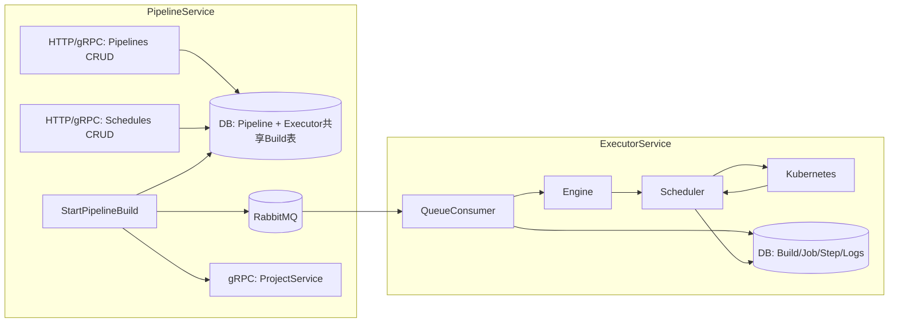

# CI Pipeline Service 文档

本文档基于当前实现重写，涵盖职责、数据流、权限与队列对接，并以图示展示与执行器的协作关系，匹配 `apps/ci/pipeline_service` 的实际行为。

## 服务职责
- 管理流水线定义（`Pipeline`）：名称、描述、所属项目、工作流 YAML、是否激活
- 管理定时计划（`PipelineSchedule`）：`cron`、`timezone`、启用状态与最近触发时间
- 触发构建：`StartPipelineBuild` 在执行器侧的共享数据库创建 `Build` 与 `BuildSnapshot`，进行入队（RabbitMQ）
- 权限对接：调用 Project 服务校验成员角色，允许项目成员（或超级管理员）触发构建，写操作需 Owner/Admin

## 架构图（Mermaid）


## 数据流与实现要点
- 启动与依赖：
  - 配置加载与数据库迁移：`apps/ci/pipeline_service/cmd/main.go:33`
  - 拨号 Project 服务：`apps/ci/pipeline_service/cmd/main.go:56`
  - 拨号 Executor 服务（目前主要由共享 DB 连接与队列完成协作）：`apps/ci/pipeline_service/cmd/main.go:66`
  - 队列初始化（RabbitMQ）：`apps/ci/pipeline_service/cmd/main.go:88`，当 `queue.url` 存在时启用
- 构建触发：
  - 权限：超级管理员放行；否则要求项目成员及以上（`apps/ci/pipeline_service/internal/service/pipeline_service.go:41` 的辅助函数）
  - 入库：创建 `Build`（状态 `PENDING`）与 `BuildSnapshot`（记录 `WorkflowYAML` 与 `sha256` 校验）
    - 路径：`apps/ci/pipeline_service/internal/service/build_service.go:52`、`74`
  - 入队：向 RabbitMQ 发布字符串消息（`build_id|pipeline_id|project_id|commit|branch`），`apps/ci/pipeline_service/internal/service/queue_executor.go:39`
- 定时计划：CRUD 接口实现于 `apps/ci/pipeline_service/internal/service/schedule_service.go:50-170`，含分页与权限校验
- Gateway：`grpc-gateway` JSON 配置与回显头部在 `apps/ci/pipeline_service/internal/gateway/pipeline_gateway.go:13`

## 权限模型
- 读取：项目成员及以上（Member+）可读取日程；超级管理员无门槛
- 写入：创建/更新/删除计划需项目 Owner/Admin（或超级管理员），参见 `ensureOwnerOrAdmin(...)`
- 触发构建：项目成员及以上（或超级管理员）允许触发

## 关键代码位置
- 构建触发：`apps/ci/pipeline_service/internal/service/build_service.go:19`、`88-102`
- 队列发布：`apps/ci/pipeline_service/internal/service/queue_executor.go:39`
- 权限辅助：`apps/ci/pipeline_service/internal/service/pipeline_service.go:41-99`
- 计划 CRUD：`apps/ci/pipeline_service/internal/service/schedule_service.go:50-170`
- Gateway：`apps/ci/pipeline_service/internal/gateway/pipeline_gateway.go:13`
- 启动入口：`apps/ci/pipeline_service/cmd/main.go`

## 与执行器的协作
- 执行器消费队列消息后：
  - 读取 `BuildSnapshot.WorkflowYAML`，解析为 DAG 与 Job/Step
  - 创建 K8s Job，流式采集日志与步骤状态
  - 引擎在所有 Job 完成后统一落库构建终态
- 终端可通过前端 WS 看到 DAG、状态与日志（执行器提供）

## 示例触发
- HTTP：`POST /ci/pipeline_service/api/v1/builds/start`（具体路径以 proto 注解为准）
- 请求体包含：`pipeline_id`、`commit_sha`、`branch`、可选 `variables`；由网关注入 `X-User-*` 用于权限判定

## 运维与调试
- 队列未启用时会返回 `FailedPrecondition: build queue not configured`
- RabbitMQ 初始化日志：见 `cmd/main.go:104`；关闭时会在优雅退出中调用 `Close`
- 构建快照可通过内部方法获取：`GetWorkflowSnapshotByBuildID`
```
