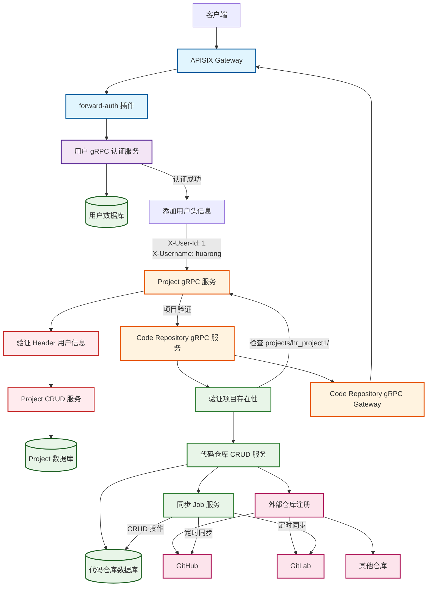

code_repository代码仓库微服务

- grpc、grpc-gateway，ApisixGateway服务
- 验证header里项目是否存在，如projects/hr_project1/
- 提供CRUD服务，项目名称（hr_project1），代码仓库名称唯一
- 可以注册代码仓库（仓库管理CRUD），比如GitHub，也可以注册别的仓库
- 再起一个job定时去GitHub代码仓库，CRUD
- db是postgress，名称为xcoding_code_repository, 用户名密码：postgres/postgres

### 权限模型
- 详见权限模型文档：[Code Repository 服务权限模型](../permissions.md)

### 3.3.1 流程图



### **3.3.2 架构详细说明：**

- **Code Repository 微服务组件：**
    1. **Code Repository gRPC 服务**
        - 通过 gRPC 协议提供服务
        - 集成 gRPC Gateway 提供 HTTP 接口
    2. **项目验证模块**
        - 验证 `projects/hr_project1/` 格式的项目路径是否存在
        - 与 Project 服务通信验证项目合法性
    3. **代码仓库 CRUD 服务**
        - 创建、读取、更新、删除代码仓库配置
        - 仓库名称唯一性约束
    4. **外部仓库注册管理**
        - 支持多种代码仓库平台注册（GitHub、GitLab 等）
        - 仓库配置信息管理
    5. **同步 Job 服务**
        - 定时从外部仓库同步数据
        - 自动执行 CRUD 操作更新本地数据
- **数据流说明：**

```
客户端 → APISIX → 用户认证 → Project 服务 → Code Repository 服务 →
验证项目 → CRUD 操作 → 外部仓库同步
```

- **数据库设计要点：**

**项目表 (projects):**

sql

```
id | user_id | name | path (projects/hr_project1/) | 其他字段...
```

**代码仓库表 (code_repositories):**

sql

```
id | project_id | repo_name (唯一) | repo_type | repo_url | 配置信息...
```

**同步记录表 (sync_logs):**

sql

```
id | repo_id | sync_time | status | 同步数据...
```

- **关键特性：**
1. **项目级权限控制**：通过项目路径验证确保用户有权访问特定项目的代码仓库
2. **多仓库平台支持**：可注册和管理 GitHub、GitLab 等多种代码仓库
3. **仓库名称唯一性**：确保同一项目内代码仓库名称唯一
4. **自动同步机制**：定时任务自动从外部仓库同步最新数据
5. **完整的 CRUD**：提供代码仓库的完整生命周期管理

这样的架构确保了代码仓库管理与项目管理的紧密集成，同时提供了灵活的外部仓库集成和自动同步能力。
